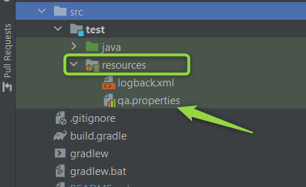

# Project for API testing :
## https://openweathermap.org/api

# Requirements
***
* JDK (version 11 or later)
* Gradle

# Tests for the following APIs:
# Part 1
* https://openweathermap.org//current
* ComparisonCurrentTemperatureWeather.class
* DataCompareJsonXml.class
***
* Request the current weather for Brest in the metric system (temperature Celsius), request the current weather for Brest in the standard system (temperature Kelvin).
* Check that the obtained temperature value in Celsius corresponds to the value obtained in Kelvin.
* Request the current weather for Brest in json form, request the current weather for Brest in xml form.
* Compare that the following values match in the json and xml responses: city coordinates, sunrise and sunset times, wind speed, pressure, temperature (min, max, feels_like).
# Part 2
* https://openweathermap.org/forecast5
* ParameterizedTestTemperatureCheck.class
***
* Request a forecast for all regional cities of Belarus and Minsk in json (parameterized test).
* Parse the answer in any way to choose from, choose from the answer the weather forecast for each day at 15:00, check that the "feels_like" temperature does not exceed 35 degrees Celsius.
# Running WeatherForecast in CI environments
Setting environment value:
* If  environment variable named "environment" is null, System.properties("environment") is checked, if it is null, then "qa" is used by default.
```html
public static String getEnv(String name) {
        String value = System.getenv(name);
        if (value == null) {
            value = System.getProperty("environment", "qa");
        }
        return value;
    }
```
***
To run a test with the necessary properties, it must be placed in the resources folder of the project, for example, with the name *qa.properties* or any other *test.properties* files with the necessary data.
* gradle test -Denvironment=qa 


